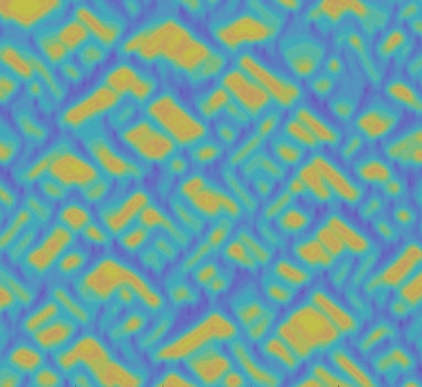

## Welcome

{style="width: 100%; height: 100px; object-fit: cover;"}

We are a theoretical and marine ecology group in the [Department of Biology](http://biology.mcgill.ca/index.html) at [McGill University](https://www.mcgill.ca/). Our research focuses on the study of ecosystems as complex systems and on the problem of scale. We are interested in understanding:

1. How large-scale patterns of biological diversity develop and are maintained from local interactions among individuals
2. The maintenance of ecosystem functions by the limited movement of individuals and (in)organic matter
3. The role of non-equilibrium dynamics and strong variability for population persistence, community structure, and ecosystem functions
4. The maintenance of asynchrony across coupled ecological networks

We address these questions by combining field experiments in marine systems with theoretical approaches in order to link patterns and processes across scales. We develop and test theories of metacommunities and meta-ecosystems, and apply their predictions to the design of marine reserve networks.

---

*Affiliated with:*

::: {layout-nrow=5}
[{width=200px}](http://www.crm.umontreal.ca/labo/cambam/) [{width=180px}](https://www.mcgill.ca/qls/)  [{width=180px}](http://www.crm.umontreal.ca/en/)[{width=180px}](http://www.quebec-ocean.ulaval.ca/) [{width=120px}](https://qcbs.ca/)
:::

